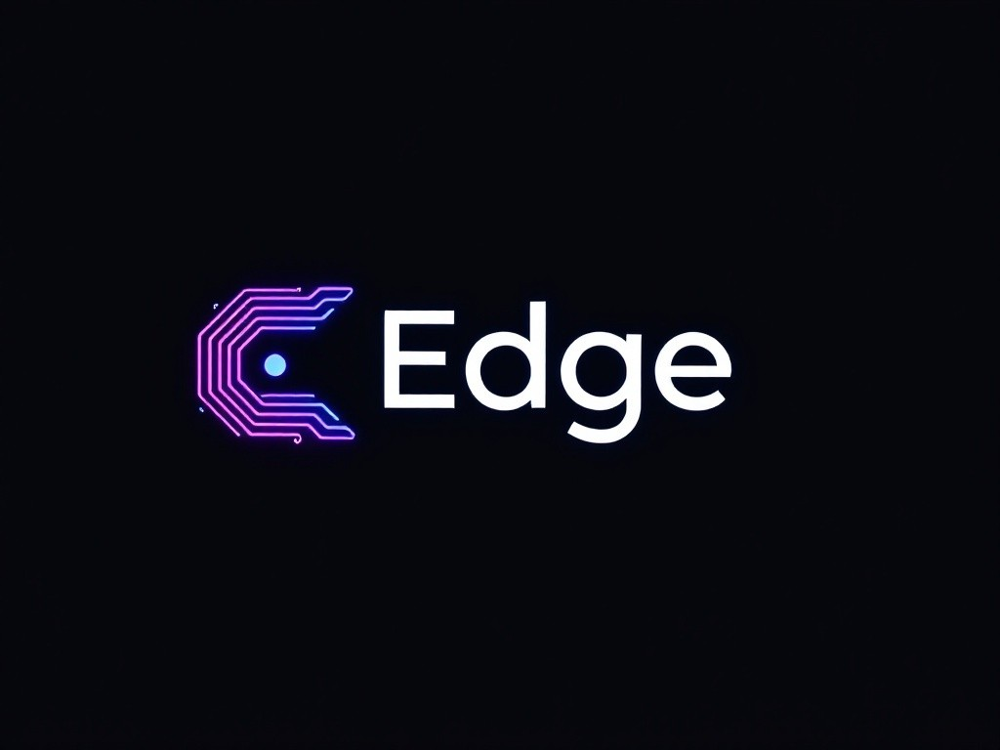
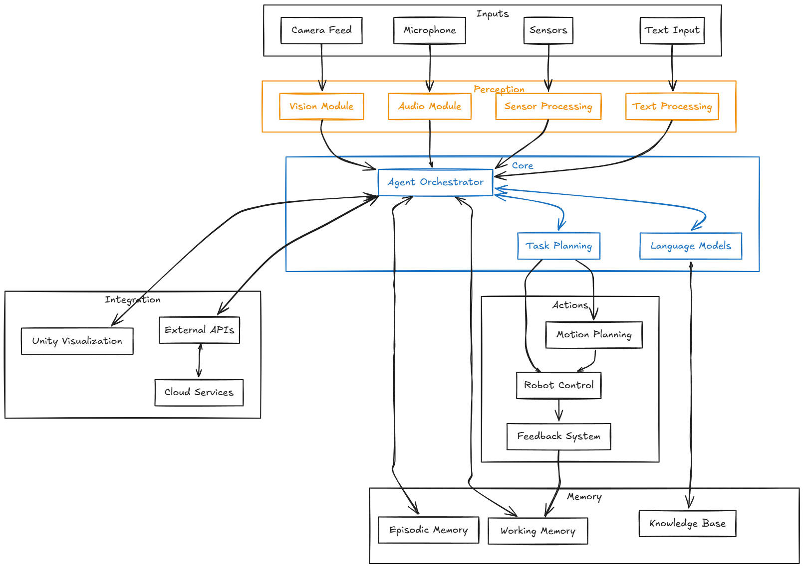

# Edge: Advanced AI Agent Framework for Robotics

<p align="center">
  
</p>

> Building the bridge between artificial intelligence and physical reality

## 🌟 Vision

Edge is a groundbreaking AI Agent framework designed to revolutionize robotics by seamlessly integrating Large Language Models (LLMs) with physical robot systems. Our mission is to create the most advanced, flexible, and intuitive framework for developing autonomous robots that can understand, learn, and interact with the real world.

## ✨ Key Features

- **Unified Agent Architecture**
  - Seamless integration of LLMs with robotic systems
  - Advanced episodic memory system for experience-based learning
  - Multi-modal perception processing (vision, audio, tactile)
  - Real-time decision making and action execution

- **Modular Design**
  - Plug-and-play module system
  - Customizable perception pipelines
  - Extensible action frameworks
  - Flexible configuration management

- **Advanced Cognitive Capabilities**
  - Natural language understanding and generation
  - Visual scene comprehension
  - Contextual decision making
  - Continuous learning and adaptation

## 🎯 System Architecture

<p align="center">
  
</p>

Our system architecture is built on three core principles:
1. **Modularity**: Every component is independent and interchangeable
2. **Scalability**: Designed to grow from simple to complex implementations
3. **Reliability**: Enterprise-grade stability for real-world applications

## 🚀 Getting Started

```bash
# Clone the repository
git clone https://github.com/gnufoo/edge.git

# Install dependencies
cd edge
npm install

# Run the setup script
npm run setup

# Start the Edge framework
npm run start
```

## 🛠 Technical Stack

- **Core Framework**: Node.js
- **AI Models**: Integration with leading LLMs
- **3D Visualization**: Unity
- **Perception**: Advanced computer vision and audio processing
- **Robot Control**: Industry-standard robotics interfaces

## 🤝 Contributing

We welcome contributions! See our [Contribution Guidelines](docs/CONTRIBUTION.md) for details on how to get involved.

## 📚 Documentation

- [Quick Start Guide](docs/quickstart.md)
- [Architecture Overview](docs/architecture.md)
- [Module Development](docs/modules.md)
- [API Reference](docs/api-reference.md)

## 🎮 Demo Projects

- [Simple Robot Assistant](examples/robot-assistant)
- [Autonomous Navigation](examples/navigation)
- [Multi-Agent Collaboration](examples/multi-agent)
- [Human-Robot Interaction](examples/interaction)

## 📈 Roadmap

- [x] Core framework implementation
- [x] Basic perception modules
- [x] LLM integration
- [ ] Advanced memory systems
- [ ] Multi-robot coordination
- [ ] Real-world deployment tools
- [ ] Cloud integration

## 🌟 Showcase

<p align="center">
  
</p>

## 📄 License

This project is licensed under the MIT License - see the [LICENSE](LICENSE) file for details.

## 🙏 Acknowledgments

Special thanks to our contributors and the open-source community for making Edge possible.

---

<p align="center">
  <a href="https://discord.gg/edge">Discord</a> •
  <a href="https://twitter.com/edge_framework">Twitter</a> •
  <a href="https://edge.dev">Website</a>
</p>
```

