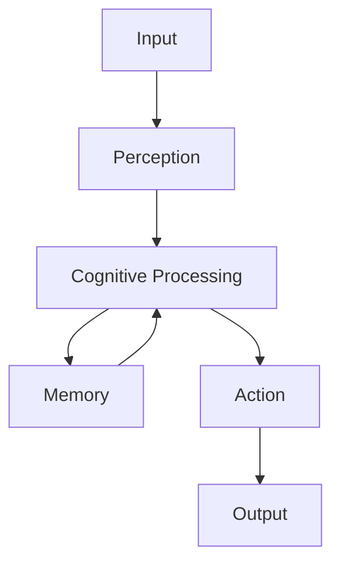

# Edge Architecture Overview

## System Design

Edge is built on a modular architecture that separates concerns into distinct layers:

1. **Perception Layer**
   - Vision Processing
   - Audio Processing
   - Sensor Integration

2. **Cognitive Layer**
   - Language Models
   - Decision Making
   - Memory Systems

3. **Action Layer**
   - Motion Planning
   - Task Execution
   - Environment Interaction

## Core Components

### EpisodicMemory

The EpisodicMemory module maintains a temporal record of experiences and interactions, enabling:
- Context-aware decision making
- Learning from past experiences
- Pattern recognition

### ConfigManager

Manages all system configurations, including:
- Module settings
- Model parameters
- Runtime configurations

### Perception Modules

- **Vision**: Real-time object detection, scene understanding
- **Audio**: Speech recognition, sound classification
- **Text**: Natural language processing, intent recognition

## Data Flow

## Integration Points

- Unity Visualization
- Robot Control Systems
- External AI Services
- Sensor Networks 